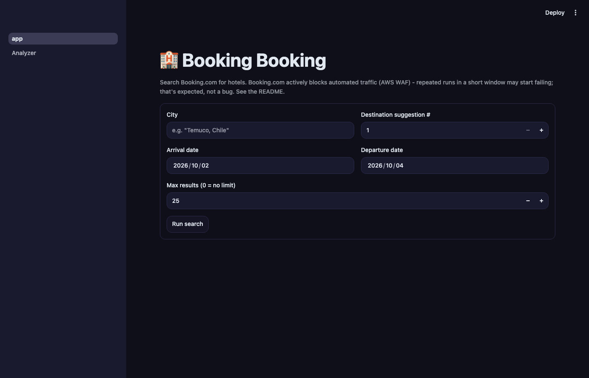
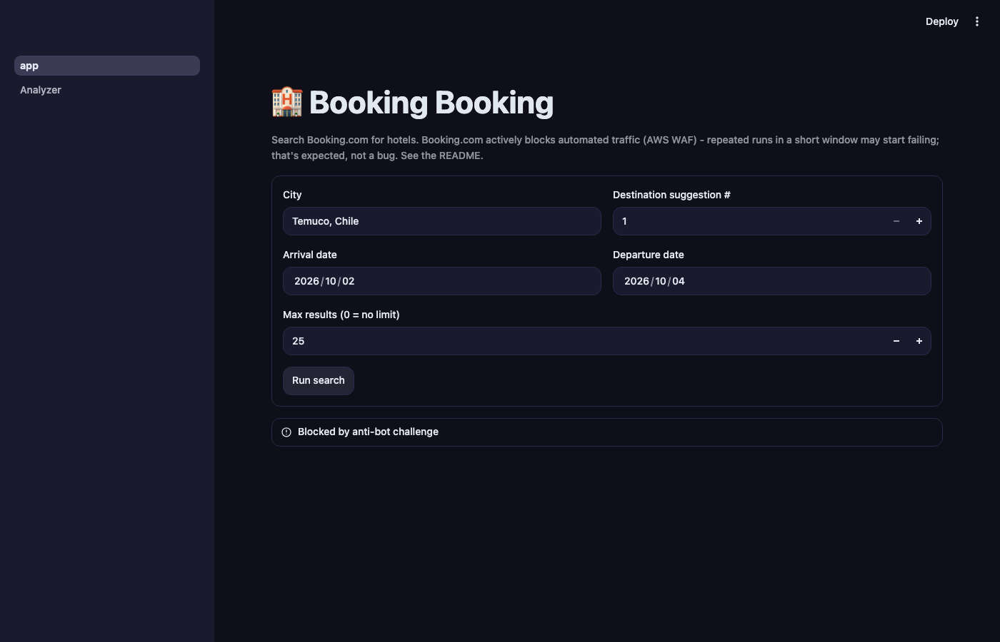
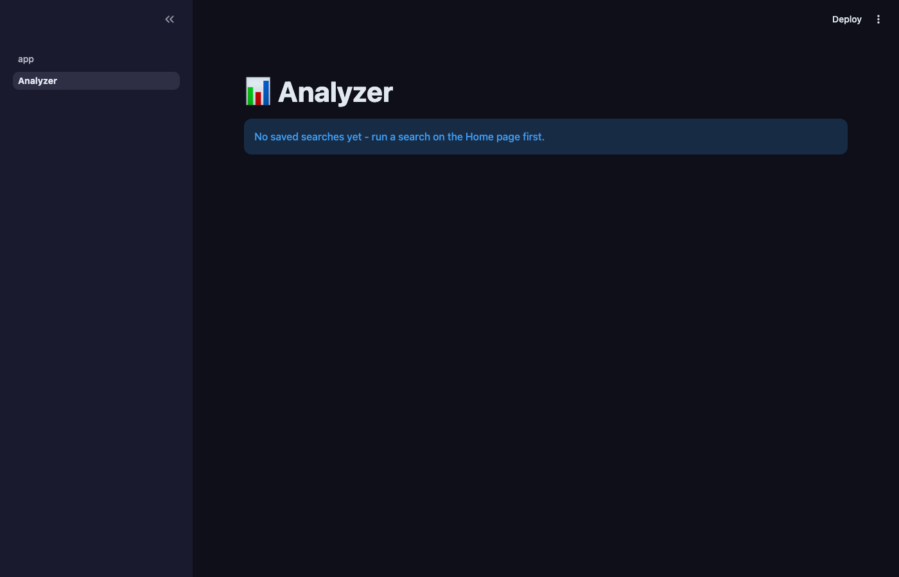

# booking-booking

A Playwright-based hotel search scraper for Booking.com: give it a `City, Country`, an arrival date, and a
departure date, and it exports the results (name, price, rating, reviews, distance from centre, ...) to CSV
or JSON.

## Screenshots

The Home screen — enter a city and date range, then run a search:



Live progress while the search runs, stage by stage (connecting, clearing the anti-bot challenge,
selecting destination/dates, collecting results):


What a blocked run looks like. These screenshots were taken live against the real site - this particular
run got blocked by Booking.com's anti-bot challenge (see the disclaimer below), and the app fails cleanly
with a clear message and no automatic retries, rather than hanging or crashing:



The Analyzer screen before any search has completed successfully - once you have saved runs, it lists them
here to select and rank by value-for-money:



## Important: this is a best-effort personal tool, not a guaranteed-working scraper

Booking.com fronts all traffic with an AWS WAF JavaScript bot challenge and its Terms of Service prohibit
automated scraping. In practice: a fresh session usually clears the challenge within a few seconds to ~15s,
but **repeated automated runs from the same IP in a short window cause the challenge to escalate**, and it
can stop clearing at all - specifically on the search-results navigation. If a run fails with a "did not
clear" error, that's expected behavior under sustained use, not necessarily a bug in this code. Space out
your runs, and don't rely on this for anything time-sensitive or high-volume.

## Requirements

- Python 3.10+
- Google Chrome/Chromium (installed automatically by Playwright, see below)

## Install

```bash
python3 -m venv .venv
source .venv/bin/activate
pip install -e ".[dev,webapp]"   # omit ",webapp" if you only want the CLI
playwright install chromium
```

## Web UI

```bash
streamlit run app.py
```

Opens a local (private to your machine) web app with two screens:

- **Home** - a form for city/dates/max results, a live progress bar while the search runs, a results table,
  and CSV/JSON download buttons. Every completed search is also saved to a local SQLite database
  (`output/booking_booking.db`) so results accumulate across runs instead of scattering into separate files.
- **Analyzer** (sidebar) - pick one or more past searches (and optionally individual listings) to inspect,
  and see a value-for-money ranking (price + rating + review-count confidence, computed independently per
  currency) with best-value picks highlighted and price-outlier cautions flagged. Download the ranked subset
  as CSV/JSON.

The anti-bot caveat below applies here too - the progress bar's error state will tell you plainly if a run
got blocked, with no automatic retries.

## Usage

Command-line:

```bash
python -m booking_booking.cli -c "Temuco, Chile" -a 2026-10-01 -d 2026-10-03
```

Interactive (prompts for city and dates if not passed as flags):

```bash
python -m booking_booking.cli
```

Flags:

| Flag | Description | Default |
| --- | --- | --- |
| `-c`, `--city` | City to search, e.g. `"Temuco, Chile"` | prompts if omitted |
| `-a`, `--arrival-date` | Arrival date, `YYYY-MM-DD` | prompts if omitted |
| `-d`, `--departure-date` | Departure date, `YYYY-MM-DD` | prompts if omitted |
| `-o`, `--option` | Which destination autocomplete suggestion to pick (1-indexed) | `1` |
| `--format` | `csv` or `json` | `csv` |
| `--append` | Append to a persistent `output/research.<format>` file instead of writing a fresh timestamped one | off |
| `--max-results` | Stop after collecting this many properties | no limit |
| `--headed` | Run with a visible browser window (useful for debugging) | off (headless) |

## Output

The CLI writes to `output/research_<timestamp>.csv` by default (or `output/research.csv` with `--append`),
one row per property: name, area, distance from centre, rating, review count, location score, price,
currency, and the searched dates. The web UI additionally persists every search and its listings to
`output/booking_booking.db` (SQLite), which is what powers the Analyzer screen.

## Development

```bash
pytest tests/unit -v         # offline, fixture-based - no network access
ruff check src tests
ruff format src tests
```

`tests/integration` contains a live smoke test against the real site (`pytest tests/integration -v -m live`).
It is **not** run in CI, for the anti-bot reasons above - run it manually, sparingly, when validating that
`src/booking_booking/config.py`'s selectors still match Booking.com's current markup.

If scraping breaks, `src/booking_booking/config.py` is the first place to check - Booking.com's DOM
structure changes over time, and every CSS selector this tool depends on is centralized there.
